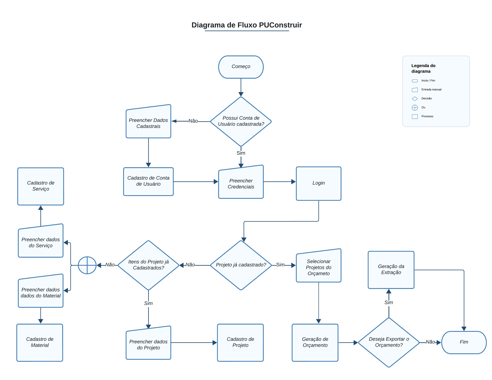
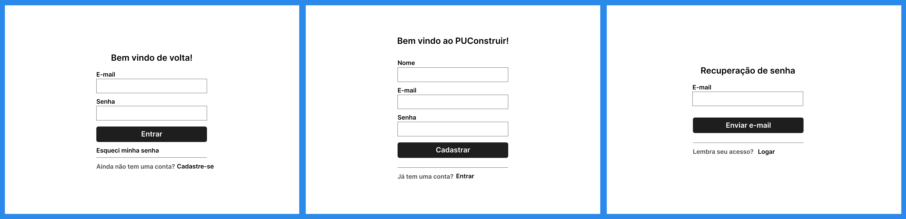
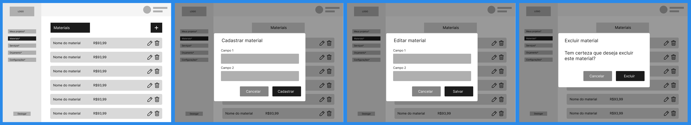
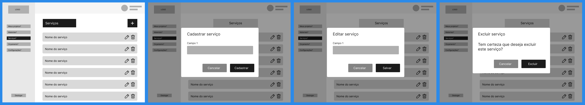
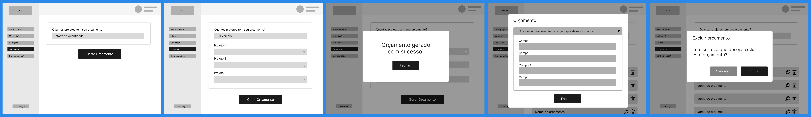
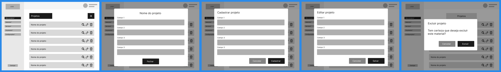
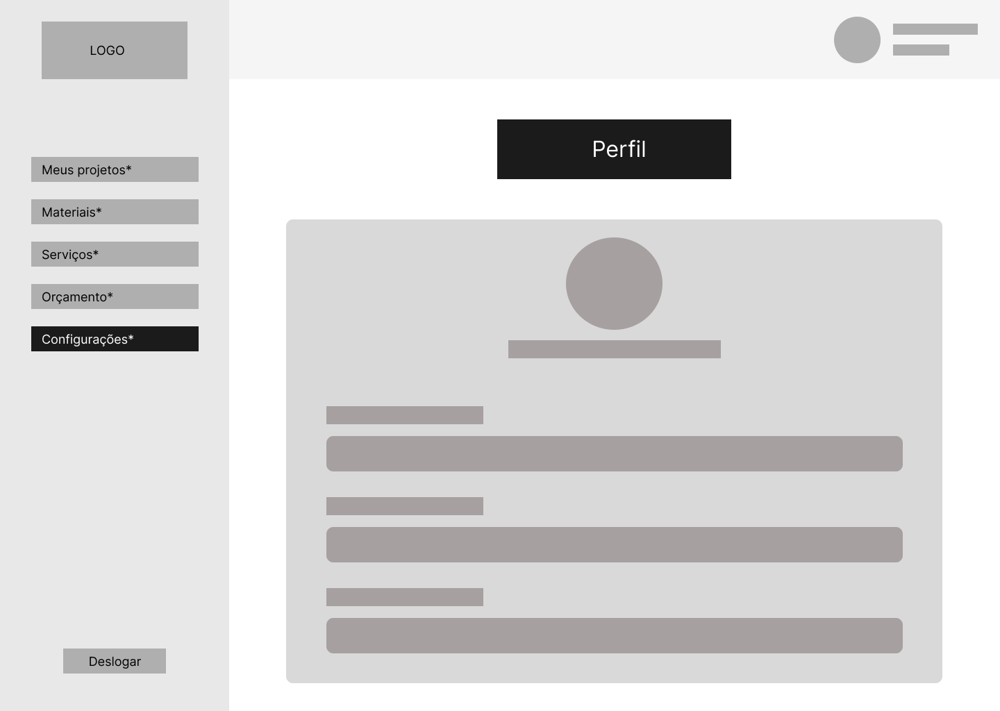

# Projeto de Interface

Pré-requisitos: <a href="2-Especificação do Projeto.md"> Documentação de Especificação</a>

## Diagrama de Fluxo

&emsp;Este diagrama representa o fluxo de interação entre o usuário e o sistema interativo. Sua geração eestudo possibilita um planejamento cuidadoso das interações e impacta positivamente a qualidade do wireframe interativo, apresentado logo em seguida.

## Wireframes

&emsp; 

