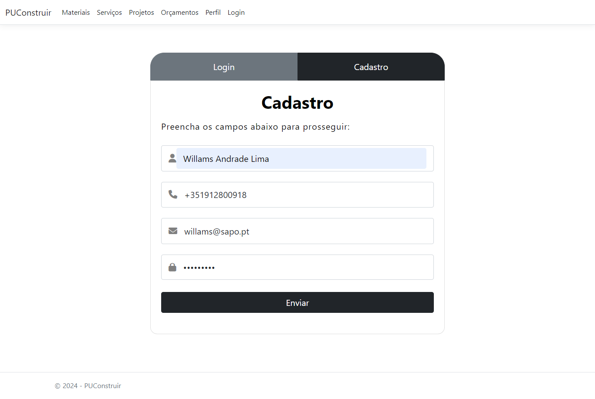
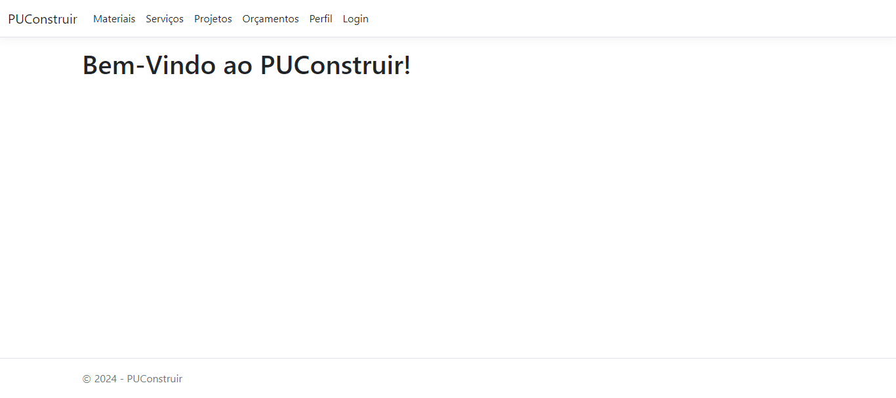
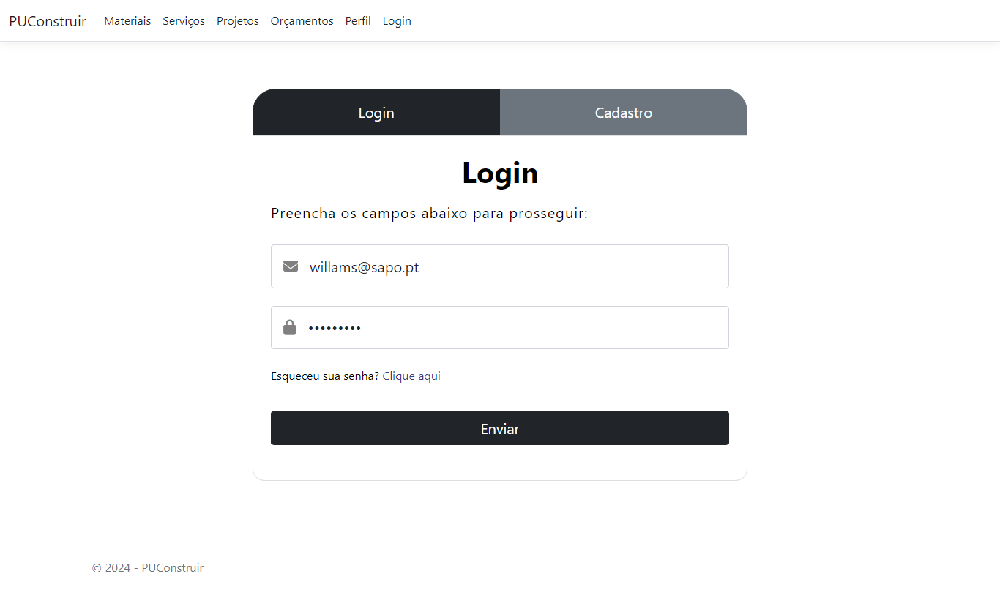
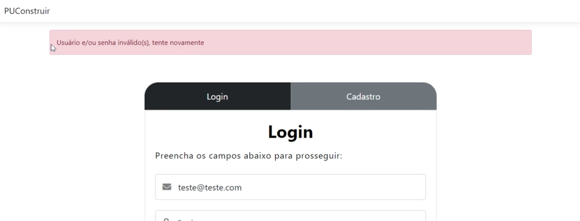

# Registro de Testes de Software

Teste 1

Pré-requisitos: <a href="3-Projeto de Interface.md"> Projeto de Interface</a>, <a href="8-Plano de Testes de Software.md"> Plano de Testes de Software</a>

Para cada caso de teste definido no Plano de Testes de Software, foi realizado o registro das evidências dos testes feitos na aplicação pela equipe. Para a Etapa 3, foram testados os requisitos RF-01 e RF-02. 

| **Caso de Teste** 	| **CT-01 – Validar a inserção de dados para criação de uma conta / Cadastrar Perfil** 	|
|:---:	|:---	|
|	Requisito Associado 	| RF-01 - <!-- A aplicação deve apresentar, na página principal, a funcionalidade de cadastro de usuários para que esses consigam criar e gerenciar seu perfil. --> Criar e gerenciar dados de login |
| Registro de Evidência	|  |
| Registro de Evidência |  |
| Registro de Evidência |  |
| Critério de Êxito | Tela de mensagem "bem-vindo" é exibida. |

| **Caso de Teste**	| **CT-02 – Efetuar login**	|
|:---:	|:---	|
|	Requisito Associado 	| RF-01 - Criar e gerenciar dados de login |
| Registro de Evidência	|  |
| Registro de Evidência |  |
| Critério de Êxito | Dados incorretos de login cadastrado trazem a mensagem de login inválido. |

Para ambos CT-01 e CT-02, encontre aqui o vídeo-apresentação da Prova de Conceito da [Etapa 3](https://github.com/ICEI-PUC-Minas-PMV-ADS/pmv-ads-2024-1-e2-proj-int-t7-grupopuconstruir/tree/main/docs/img/videoApresentacao_Etapa3.mp4)

Teste 2

Para cada caso de teste definido no Plano de Testes de Software, foi realizado o registro das evidências dos testes feitos na aplicação pela equipe. Para a Etapa 3, foram testados todos os requisitos.

| **Caso de Teste**	| **CT-01 – Validar a inserção de dados para criação de uma conta**|

|:---:	|:---	|
|	Requisito Associado 	|RF-01 - Criar e gerenciar dados de login|
| Registro de Evidência	|  |
| Critério de Êxito | Tela de mensagem "bem-vindo" é exibida. |

| **Caso de Teste**	| **CT-02 – Efetuar login**	|
|:---:	|:---	|
|	Requisito Associado 	| Verificar se o usuário consegue logar-se na aplicação. |
| Registro de Evidência	| tela bem vindo - puconstruir.png |
| Critério de Êxito |Tela de mensagem "bem-vindo" é exibida.|

| **Caso de Teste**	| **CCT-03 – Recuperar senha de acesso**	|
|:---:	|:---	|
|	Requisito Associado 	| RF-02 - O usuário deve conseguir recuperar senha |
| Registro de Evidência	|  |
| Registro de Evidência |  |
| Critério de Êxito |Tela de mensagem "bem-vindo" é exibida.

## Avaliação

<!-- Discorra sobre os resultados do teste. Ressaltando pontos fortes e fracos identificados na solução. Comente como o grupo pretende atacar esses pontos nas próximas iterações. Apresente as falhas detectadas e as melhorias geradas a partir dos resultados obtidos nos testes.

> **Links Úteis**:
> - [Ferramentas de Test para Java Script](https://geekflare.com/javascript-unit-testing/)
-->
